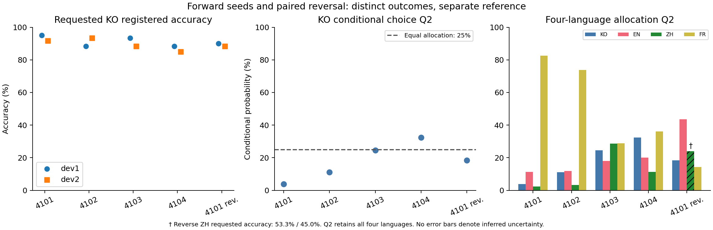

# Language Choice under Curriculum Reversal

작은 언어 모델에서 **요청한 한국어 표현을 산출하는 정확도**와 **언어를 지정하지 않았을 때 등록 표현에 배분되는 조건부 확률**을 비교한 탐색적 연구입니다. 정순 seed 4101–4104와 같은 4101 T0 상태에서 시작한 역순 1회를 포함합니다.

- [최신 논문 초안](paper/draft.md)
- [결과 표와 ZH 해석 주석](paper/results_table.md)
- [비교 그림 PDF](paper/comparison.pdf)
- [관련 연구 전문 대조](paper/related_work_notes.md)
- [보고 수치의 단일 JSON 출처](paper/summary.json)



## 핵심 결과와 범위

정순 한국어 지정 정확도는 문구·seed별 85–95%입니다. KO Q2는 3.80%, 11.18%, 24.53%, 32.45%로, 25% 균등 기준보다 뚜렷하게 낮은 선택은 첫 두 seed에서 관측됩니다. 역순 4101의 EN Q2는 43.57%이며 정순 범위 11.29–20.14%를 넘습니다.

Q2는 60개 개념과 두 문구에 대한 **등록 문자열 조건부 확률 평균**이며 실제 생성 언어 비율이 아닙니다. 정확도와 Q의 차이를 동일 척도의 효과 크기로 해석하지 않습니다. 역순 ZH 지정 정확도는 53.3%/45.0%이므로 표의 주석을 함께 읽어야 합니다. readiness 및 문구 안정성 게이트는 여전히 미달입니다. 순수 순서·최근성 효과, 능력 불변, 일반 언어 능력 또는 본시험 성공을 주장하지 않습니다.

## GPU 없이 결과 검증

Python 3.10 이상에서 저장소 루트 기준:

```bash
python3 tools/verify_results.py
python3 -m unittest discover -s tests
```

첫 명령은 압축된 평가 원본의 SHA-256을 확인하고, 다섯 최종 조건의 Q2·지정 정확도·Z·생성 집계를 다시 계산합니다. 모델 다운로드나 GPU가 필요하지 않습니다. 원본의 절대 경로는 출처 기록으로 유지되며 검증기는 `evidence/index.json`으로 현재 저장소의 파일에 대응시킵니다.

## 구성

| 경로 | 내용 |
|---|---|
| `paper/` | 현재 초안, 그림, 표, 수치 JSON |
| `evidence/objects/` | 해시로 식별되는 원래 JSON 바이트의 gzip 보관본 |
| `evidence/index.json` | 실험 파일 경로와 보관 객체의 대응, 포함되지 않은 JSON 참조 목록 |
| `evidence/checkpoints.json` | 서버에 보존한 대용량 체크포인트 목록 |
| `implementation/` | 학습·평가 구현, 버전별 프로토콜·의존성·시험 |
| `spec/`, `freshstart/`, `tests/` | 변경하지 않은 원래 명세와 참조 코드·시험 |
| `SOURCE_SNAPSHOT.json` | 원래 실험 코드 commit과 내보내기 범위 |

## 학습 재현의 범위

이 저장소는 결과를 검증할 수 있는 코드·평가 자료 배포본입니다. 수 GB의 가중치, 원시 코퍼스, 가상환경, 인증정보는 Git에 넣지 않았습니다. 원래 단계 종점 가중치는 실험 서버에 보존돼 있습니다. 저장소만 clone하여 기존 실행을 즉시 resume할 수 있다는 뜻은 아닙니다. 학습 재실행은 `implementation/protocol/`과 고정 의존성을 따르고, 데이터 준비·freeze·환경 replay 검증이 필요합니다. 원래의 머신 경로와 commit에 묶인 무결성 검사를 우회하지 마세요.

새 업로드 commit은 원래 학습 commit과 다릅니다. `SOURCE_SNAPSHOT.json`이 원래 commit을 기록합니다. 초기 전달물의 `MANIFEST.json`과 `SHA256SUMS.txt`는 그 전달물에 대한 문서이며 이 저장소 전체의 manifest가 아닙니다.

## 데이터와 권리

출처와 권리는 [자료 출처 문서](docs/SOURCES_KO.md)를 따릅니다. 외부 논문은 관련 연구의 원문 링크로 인용합니다. 새로운 포괄 라이선스는 부여하지 않았으며 원자료·의존성의 기존 조건을 유지합니다. API 키나 토큰을 저장소 또는 issue에 올리지 마세요.
